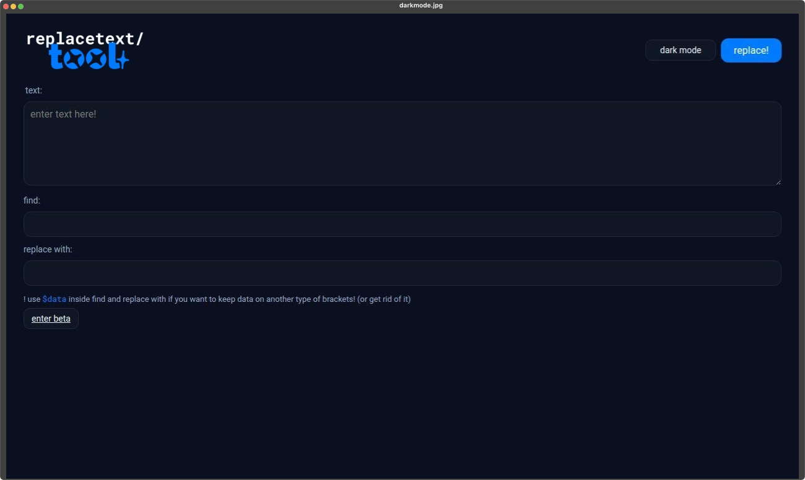

# replacetext/tool
filling text
 
## what is this?
this is a simple HTML (that means it's a web) that the only purpose it has is to help you change characters on a text.
usage is very simple :D
## how2 use 
to use this tool, first open up the web at https://fergasas1.github.io/replacetext-tool/ .
second thing, paste or write your text in the text box (the first and biggie one)
after that, just go onto the second text box and put what to find (if you want to grab data that is on (parentheses) or something else type ($data))
and to end, put what you want the found characters to transform into and hit replace!

obviously enjoy! :P
